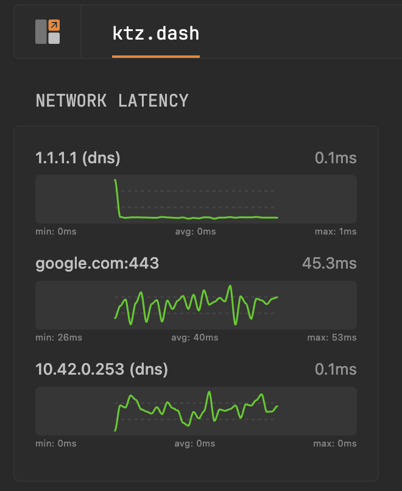

# glance-ping-graph

Network latency graphs for [Glance](https://github.com/glanceapp/glance).



## Quick Start

```yaml
services:
  ping-graph:
    image: ghcr.io/ironicbadger/glance-ping-graph:latest
    ports:
      - 8080:8080
    environment:
      - TARGETS=1.1.1.1:icmp,google.com:tcp:443
```

Add to `glance.yml`:

```yaml
- type: extension
  url: http://ping-graph:8080
  allow-potentially-dangerous-html: true
```

## Configuration

| Variable | Default | Description |
|----------|---------|-------------|
| `TARGETS` | `8.8.8.8:icmp,1.1.1.1:icmp` | Targets to probe |
| `INTERVAL` | `60s` | Probe frequency |
| `HISTORY` | `1h` | Graph timespan |

**Target formats:** `host:icmp`, `host:tcp:port`, `host:dns`, or `Name=host:type`

## License

MIT
